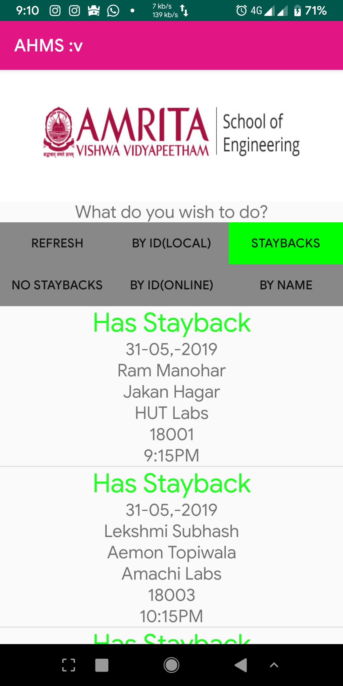
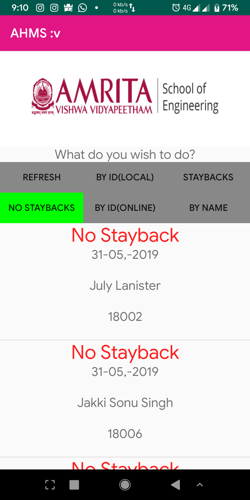
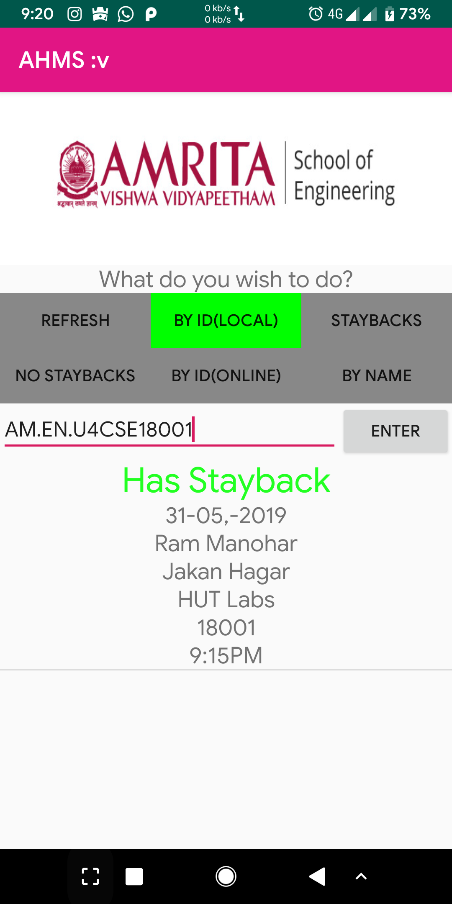

# AHMS_app
This is my first try to create an Android client for Hostel Management for Amrita University, along with FOSS@amrita

### Tip to Note :
  - There are certain loopholes present . They are listed as comments in the project, and are soley made by myself in order to understand the flow of control.
  - Since not done with recyclerview, there is less memory optimisation. Will fix later.
  - Also done with Java, Built with :bold Android Studio.
  
### Installing

- Fork the repository. 
- Clone the repo using the terminal command. Make sure you replace `username` with your GitHub username.
```bash
git clone https://github.com/username/AHMS_app.git 
```
### Setting up the Android Project


1. Open Android Studio, and check if it successfully builds.

  - _Note:_ If you receive a Gradle sync error titled, "failed to find ...", you should click on the link below the error message (if available) that says _Install missing platform(s) and sync project_ and allow Android studio to fetch you what is missing.

2. Once all build errors have been resolved, you should be all set to build the app and test it.

3. To Build the app, go to _Build>Make Project_ (or alternatively press the Make Project icon in the toolbar).

4. If the app was built successfully, you can test it by running it on either a real device or an emulated one by going to _Run>Run 'app'_ or pressing the Run icon in the toolbar.

### Libraries used here

- Retrofit [Docs](http://square.github.io/retrofit/2.x/retrofit/)
- GSON Converter [Docs](https://github.com/square/retrofit/tree/master/retrofit-converters/gson/)
### API Used
https://github.com/AbhilashG97/solid-octo-giggle

## License

This project is licensed under the MIT License, see the LICENSE https://github.com/abhinandhari/AHMS_app/blob/master/LICENSE

### A WORD OF THANKS TO MY MENTORS, RAJENDRA AND ABHILASH BHAIYYA, FOR ALLOWING ME TO GET THIS FAR, WITHIN SUCH A SHORT SPAN OF TIME.
https://github.com/AbhilashG97 , https://github.com/immadisairaj .

###Screenshots






